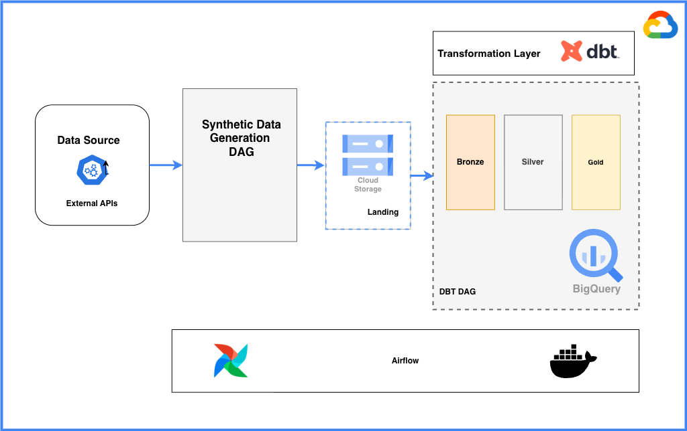
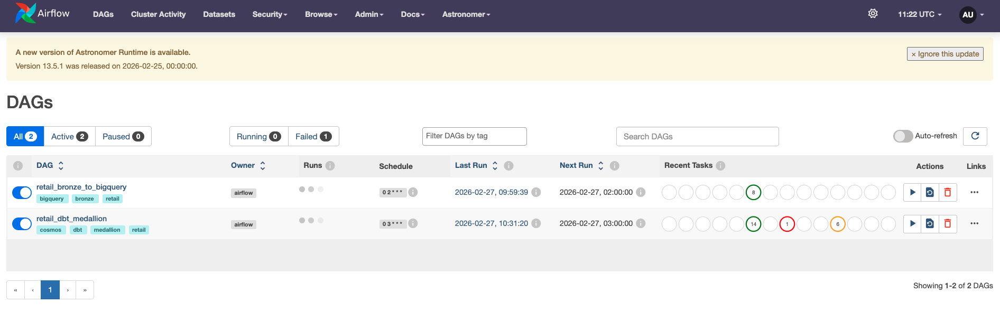
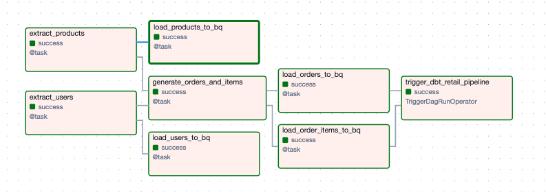
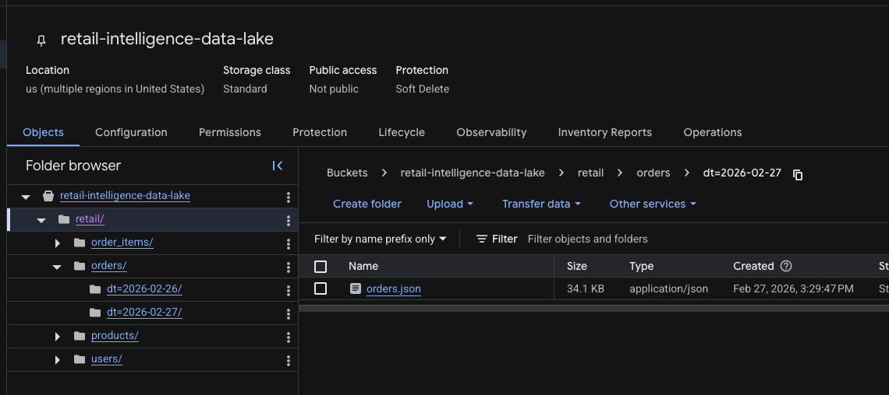
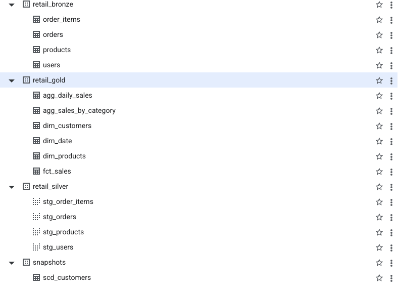
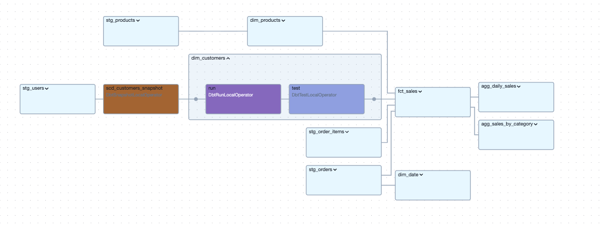
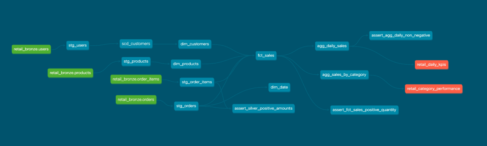
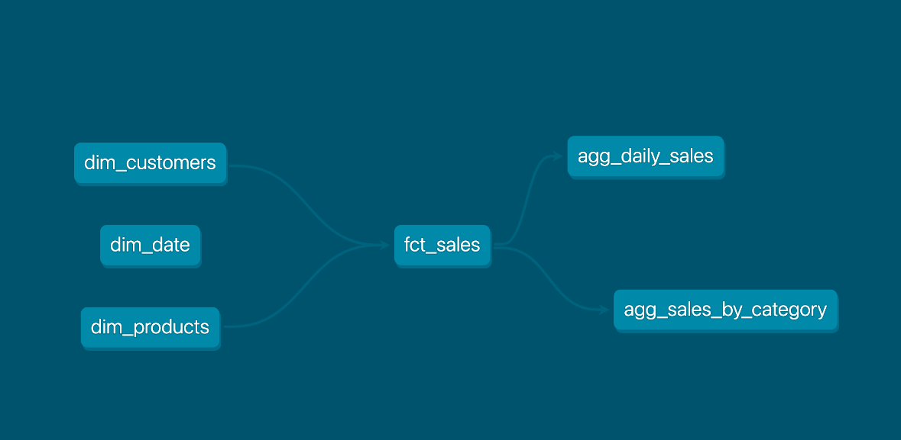

# Retail Intelligence Platform

End-to-end retail analytics pipeline using **Airflow (Astronomer)**, **GCS**, **BigQuery**, **dbt** (medallion architecture), and **Terraform**.

---

## Architecture

The platform ingests synthetic retail data into GCS, loads it into BigQuery bronze tables, then runs dbt to build silver (staging) and gold (dimensions, fact, aggregations) layers. Airflow orchestrates the full flow; Terraform provisions GCS and IAM.



- **Synthetic generator** (`dags/synthetic_sales_generator.py`) — products & users from DummyJSON; orders & order items generated for the run date.
- **Bronze DAG** (`dags/retail_data_pipeline.py`) — extracts to GCS, loads into BigQuery `retail_bronze`.
- **dbt project** (`dags/dbt_retail`) — silver staging models and gold dims/fact/aggs.
- **Cosmos dbt DAG** (`dags/retail_dbt_medallion.py`) — runs dbt after bronze load, using the `dbt_venv` in the image.

---

## Airflow



DAGs run on schedule; the bronze pipeline loads raw data, then the dbt DAG builds the medallion layers.



- **retail_bronze_to_bigquery** — Extract products/users, generate orders/order items, upload to GCS, load into BigQuery bronze tables.
- **retail_dbt_medallion** — Waits for bronze, then runs the dbt project (Cosmos).

---

## GCS layout

Data is written under `retail/` partitioned by date:



- `retail/products/dt=<ds>/products.json`
- `retail/users/dt=<ds>/users.json`
- `retail/orders/dt=<ds>/orders.json`
- `retail/order_items/dt=<ds>/order_items.json`

---

## BigQuery

Bronze tables live in the `retail_bronze` dataset; dbt creates `retail_silver` and `retail_gold` (staging, dimensions, fact, aggregations).



---

## dbt medallion

Project root: `dags/dbt_retail`. Layers:

- **Bronze** — Sources only; tables in `retail_bronze`.
- **Silver** — `stg_orders`, `stg_order_items`, `stg_users`, `stg_products` (cleaned, renamed).
- **Gold** — `dim_customers`, `dim_products`, `dim_date`; `fct_sales` (fact); `agg_daily_sales`, `agg_sales_by_category`.







### dbt commands

From the project root (or inside the Airflow container at `dags/dbt_retail`):

```bash
# Install packages (e.g. dbt_utils)
dbt deps

# Compile (no run)
dbt compile

# Run all models
dbt run

# Run only silver or gold
dbt run --select tag:silver
dbt run --select tag:gold

# Run specific models
dbt run --select stg_orders stg_order_items
dbt run --select fct_sales+
dbt run --select dim_customers dim_products dim_date

# Run tests (schema + singular)
dbt test

# Run tests for a layer
dbt test --select tag:silver
dbt test --select tag:gold

# Build (run + test)
dbt build

# Full refresh for incremental models
dbt run --full-refresh
```

---

## Run locally (Astronomer)

**Prerequisites:** Docker, Astro CLI, GCP project with BigQuery + GCS, and a service account (or ADC).

```bash
astro dev start
```

UI: `http://localhost:8080`

```bash
astro dev stop
```

**Configuration:**

- **Variable:** `RETAIL_GCS_BUCKET` = your GCS bucket name.
- **Connection:** `google_cloud_default` = GCP credentials (used by bronze DAG and dbt via Cosmos).

---

## Terraform

GCS bucket and IAM are in `terraform/`:

```bash
cd terraform
terraform init
terraform plan
terraform apply
```

Use outputs for `RETAIL_GCS_BUCKET` and the Airflow service account.
